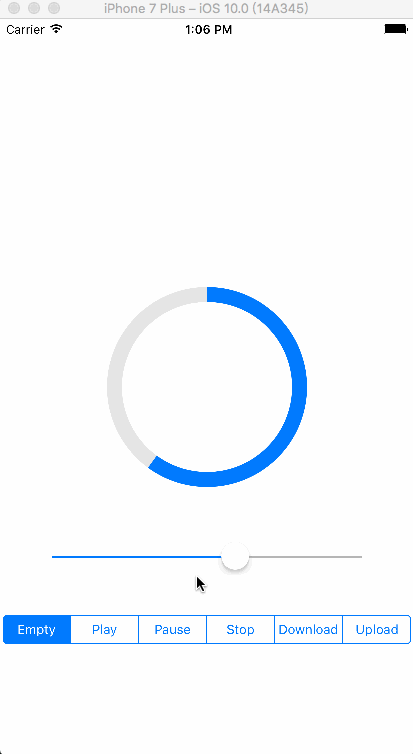

# XXCircularProgressView

It's a circular ProgressView and is very simple and easy to use for Swift. According to your different needs, it contains Empty、Play、Pause、Stop、Download and Upload six different styles in all for you to choose. 

## Cocoapods

`XXCircularProgressView` is available through [CocoaPods](http://cocoapods.org). To install
it, simply add the following line to your Podfile:

```
pod "XXCircularProgressView"
```

## Usage

When use it, you need to create the `XXCircularProgressView` first:

```
var progressView: XXCircularProgressView!
```

Then, you can update the value of `XXCircularProgressView` and choose the style of it according to your needs in your project: 

```
progressView.progress = CGFloat(sender.value);
```

```
var style: XXCircularProgressView.XXIconStyle = .empty;
```

That's all !  Isn't it very simple to use? In addition, I will show you the Demo result in this project here:



